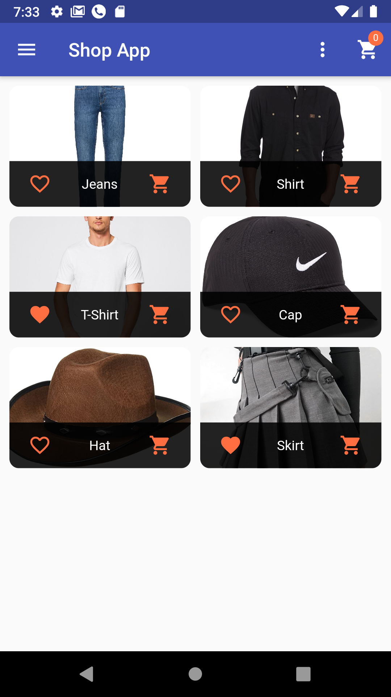
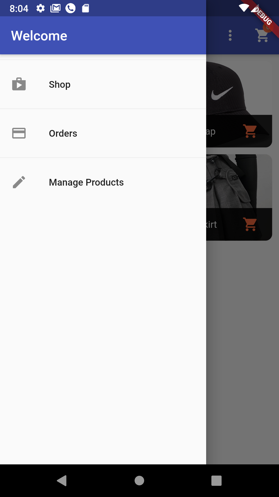
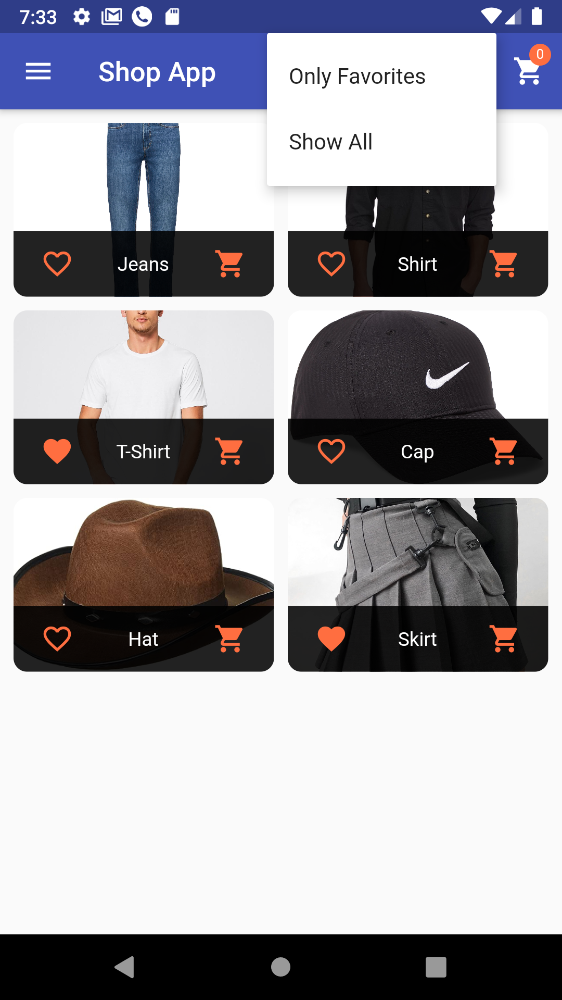
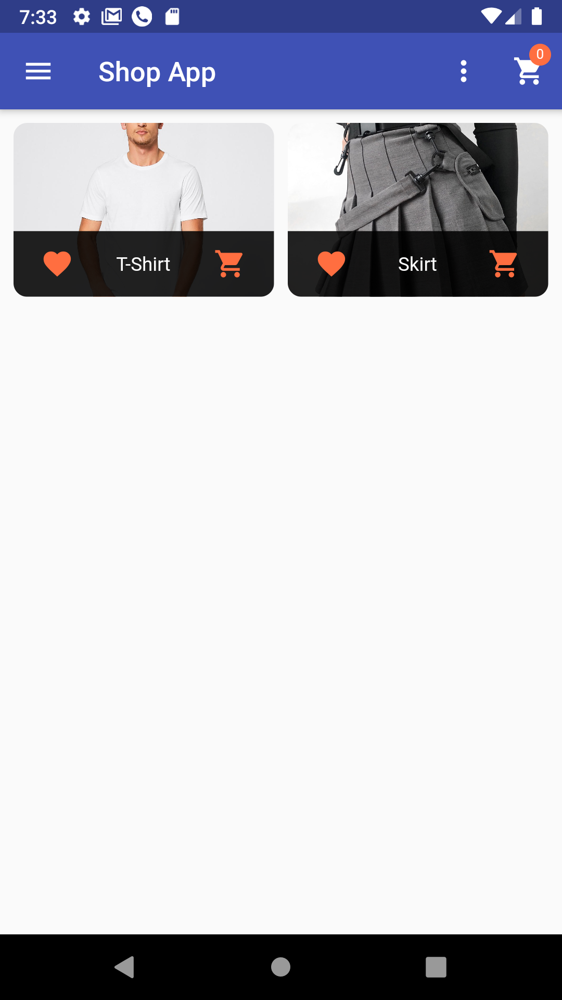
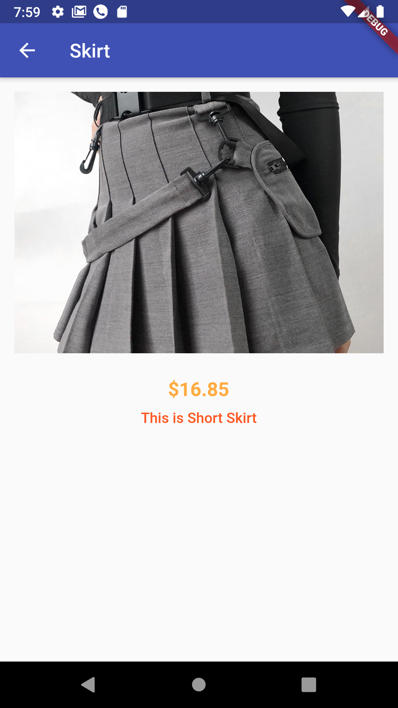
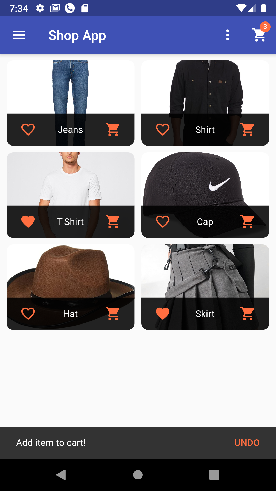
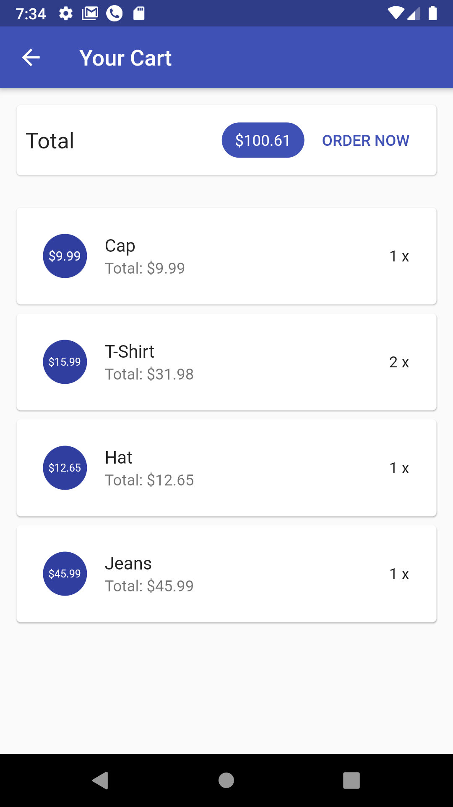

# Shop App

This is a Shop App 

# Tools
- State Management & Provider
- MVC Design Pattern
- Intl Package
- Firebase Core Package
- Cloud Firestore Package
- Http Package
- Firebase (Realtime Database)

# Features
- Connecting With Database
- Retrieve Data From Database 
- Interacting With The User And Collecting Data
- Fetch User Input Via Forms And Input Valdiation
- Managing Data And The UI Efficiently
- Interacting With Web Servers
- Storing , Fetching , Delete And Updating Data By Sending Http Requests To Database

# Screenshots 
There are Some Screenshots to Show How My App Look. Open Screenshots Folder To See More Pictures(App/Firebase Pictures) 

